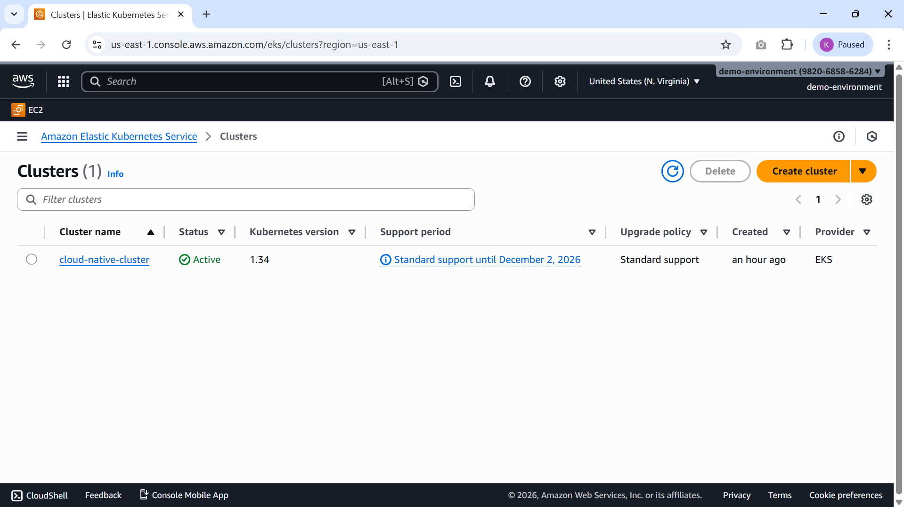
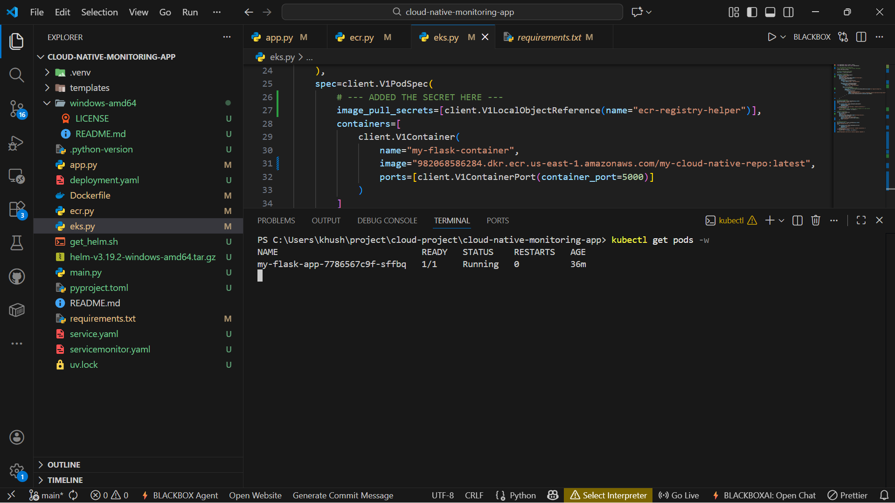

# ☁️ Cloud-Native Monitoring Application 

A production-ready monitoring solution built with **Python** and **Flask**, containerized with **Docker**, and orchestrated on **Amazon EKS (Elastic Kubernetes Service)**. This project demonstrates a complete cloud-native workflow, including automated image management via **Amazon ECR**.

## 🛠️ Tech Stack

- **Backend:** Python 3.10+ (Flask)
- **Infrastructure:** AWS EKS, AWS ECR
- **DevOps:** Docker, Kubernetes (Client SDK), Helm
- **Package Management:** `uv` / `pip`

## 📂 Project Structure

- `app.py`: Main Flask application.
- `ecr.py`: Handles AWS ECR repository creation and image uploads.
- `eks.py`: Programmatically manages Kubernetes deployments and services.
- `deployment.yaml` & `service.yaml`: Kubernetes manifests for manual or scripted deployment.
- `Dockerfile`: Container configuration for the Flask app.

## 📋 Prerequisites

- **AWS CLI** configured (`aws configure`).
- **Docker** installed and running.
- **kubectl** installed for cluster management.
- **Python 3.x** installed.

## 🚀 Getting Started

### 1. Clone & Install

```bash
git clone [https://github.com/KhushiKachhawaha14/cloud-native-monitoring-app.git](https://github.com/KhushiKachhawaha14/cloud-native-monitoring-app.git)
cd cloud-native-monitoring-app
pip install -r requirements.txt
```

2. AWS Setup & Deployment
   Run the ECR script to push your image:

```bash
python ecr.py
```

Deploy the application to your EKS cluster:

```bash
python eks.py
```

To prove your deployment worked, add a small section at the end of the "Getting Started" area. This shows you know how to validate your work:

3. Verify the Deployment

```bash

kubectl get pods
kubectl get svc
```

🔒 Security Best Practices
To avoid hardcoding sensitive information like AWS Account IDs or Regions (as seen in eks.py), it is recommended to use environment variables.

Example Update for eks.py: Instead of a hardcoded string, use:

```bash

import os
account_id = os.getenv('AWS_ACCOUNT_ID')
image_uri = f"{account_id}[.dkr.ecr.us-east-1.amazonaws.com/my-cloud-native-repo](https://.dkr.ecr.us-east-1.amazonaws.com/my-cloud-native-repo)"

```

## 📊 Deployment Evidence

To verify the successful deployment of the monitoring application, I monitored both the AWS Infrastructure and the Kubernetes cluster state.

### 1. AWS Infrastructure (EKS & ECR)

The cluster `cloud-native-cluster` was provisioned and is active in the `us-east-1` region. The container image is successfully stored in the Amazon ECR private repository.



### 2. Kubernetes Pod Status

Using `kubectl`, I verified that the Flask application pod is in the `Running` state and ready to handle traffic.



👥 Credits
Original Developer: N4si

Implementation & Deployment: Khushi Kachhawaha


